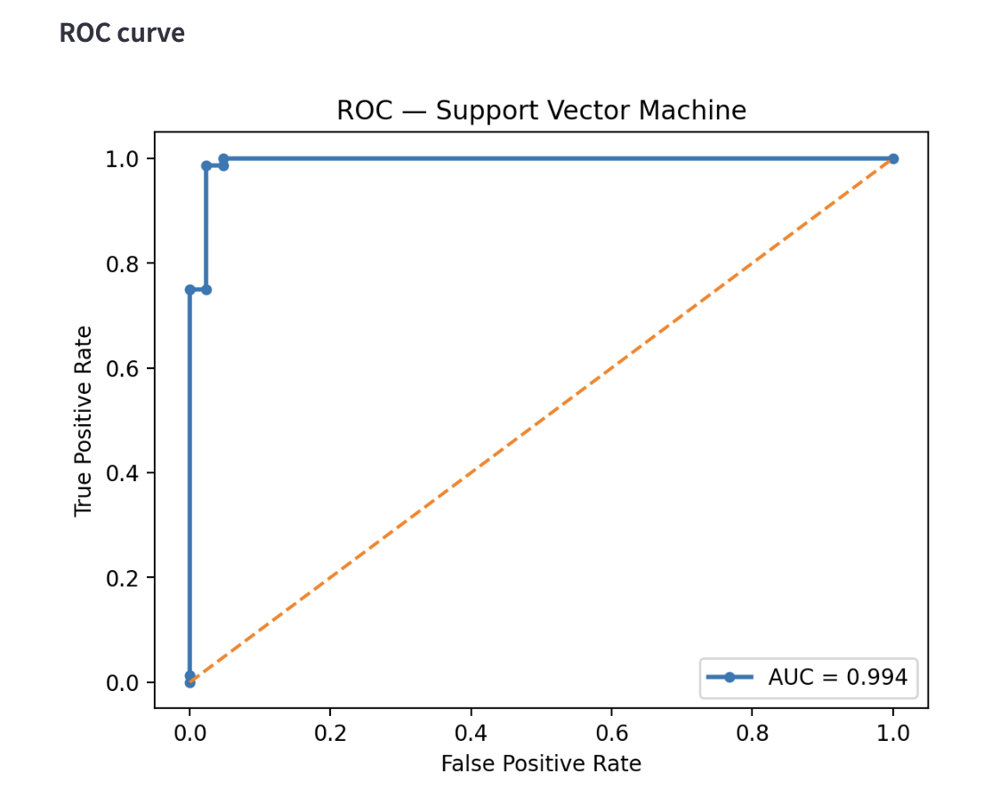
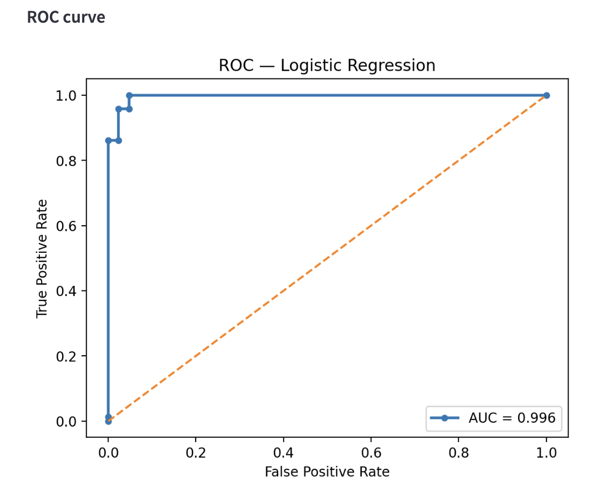
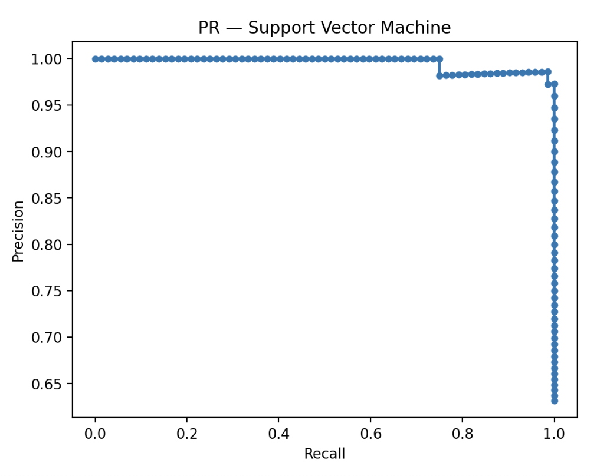
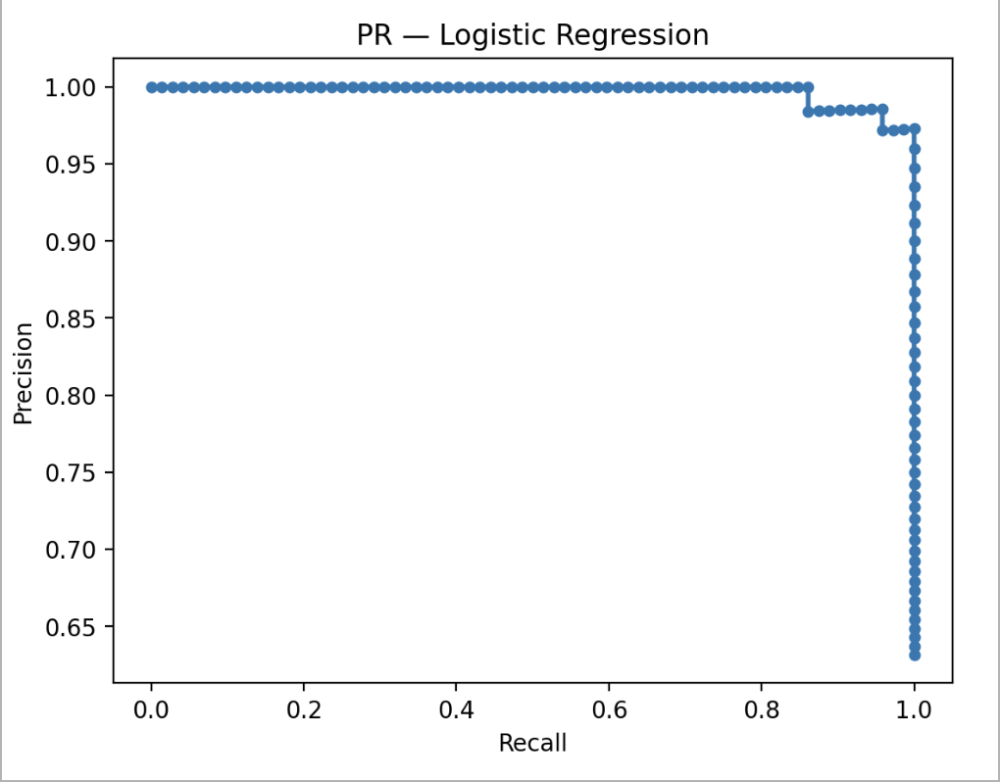
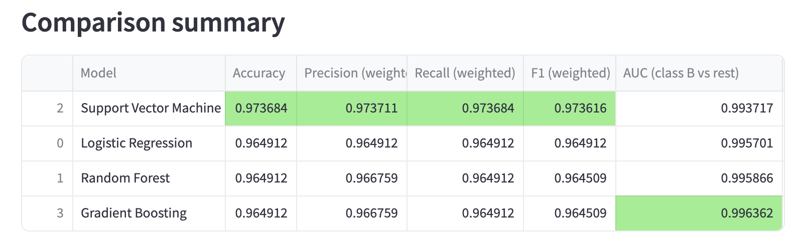

# 📊 Model Comparison Tool
**An end-to-end machine learning evaluation app for fair model selection**

> **TL;DR**  
> An interactive ML application that trains and compares multiple classification models using standardized preprocessing, metrics, and visualizations to support real-world deployment decisions.

---

## Overview
The **Model Comparison Tool** is an interactive machine learning application designed to **train, evaluate, and compare multiple classification models on the same dataset**.

Instead of selecting a model based on a single metric or intuition, this tool enables **data-driven model selection** by visualizing performance trade-offs such as precision vs recall, interpretability vs accuracy, and simplicity vs robustness.

This mirrors how model selection is done in real production ML systems.

---

## Key Features
- Train **multiple ML models** on the same dataset
- Apply a **shared preprocessing pipeline** for fair comparison
- Compute and visualize **standard classification metrics**
- Compare models side-by-side using tables and plots
- Interactive **Streamlit UI** for easy exploration
- Modular design for extensibility

---

## Supported Models
Each model represents a different modeling philosophy commonly used in practice:

| Model | Type | Key Strength |
|------|------|-------------|
| Logistic Regression | Linear | Interpretable baseline |
| K-Nearest Neighbors | Instance-based | Captures local patterns |
| Support Vector Machine | Margin-based | Strong generalization |
| Decision Tree | Rule-based | Human-readable logic |
| Random Forest | Bagging ensemble | Robust & stable |
| Gradient Boosting | Boosting ensemble | High performance on tabular data |

---

## 🚀 How to Run

### Prerequisites
- Python **3.9+**
- pip

### Installation & Launch
```bash
# Clone the repository
git clone https://github.com/zahmedy/Model-Comparison-Tool.git
cd Model-Comparison-Tool

# Create virtual environment (recommended)
python -m venv .venv
source .venv/bin/activate   # macOS / Linux
# .venv\Scripts\activate    # Windows

# Install dependencies
pip install -r requirements.txt

# Launch the Streamlit app
streamlit run app.py
```
----

## Default Dataset: Breast Cancer Wisconsin

## 🧠 Model Decision For Default Dataset

### Problem Context
This dataset represents a binary classification problem where both false positives and false negatives carry meaningful cost.  
Rather than selecting a model based solely on accuracy, the decision was made by analyzing **ROC curves, Precision–Recall curves, and probability behavior**.

---

### Candidate Models
The final comparison focused on:
- **Support Vector Machine (SVM)**
- **Logistic Regression**

Both models achieved strong performance across standard metrics.

---

### ROC Curve Analysis
Both SVM and Logistic Regression demonstrate excellent ROC curves, with AUC values close to 1.0.

- This indicates that **both models rank positive samples above negative samples extremely well**
- The difference in ROC-AUC between the two models is negligible and not statistically meaningful

**Conclusion:**  
ROC curves confirm strong separability but do not meaningfully differentiate the models.

---

### Precision–Recall Curve Analysis
The Precision–Recall curves reveal important behavioral differences:

- **SVM** maintains near-perfect precision across most recall values but exhibits a **sharp precision drop** when recall approaches its maximum
- **Logistic Regression** shows a **more gradual and stable precision decline** as recall increases

This suggests:
- SVM is more **aggressive and confident**, but brittle at extreme thresholds
- Logistic Regression provides **smoother and more reliable probability tradeoffs**

---

### Probability Calibration Considerations
Logistic Regression produces naturally well-calibrated probabilities, making it safer for:
- threshold tuning
- cost-sensitive decisions
- deployment scenarios where probability estimates are used directly

SVM probabilities, while usable after proper pipeline handling, are more sensitive and often require explicit calibration.

---

### Final Decision
**Logistic Regression** is selected as the preferred model for deployment.

**Justification:**
- Comparable accuracy and recall to SVM
- Slightly stronger and more stable ROC-AUC
- Better probability calibration
- More predictable behavior when adjusting decision thresholds

> When performance is similar, preference is given to models that provide stable probabilities and interpretable decision behavior.

---

### Summary
This decision demonstrates the importance of:
- evaluating models beyond accuracy
- inspecting ROC and Precision–Recall curves
- understanding probability behavior in real-world ML systems

---

### ROC Curves

**Support Vector Machine**


**Logistic Regression**


---

### Precision–Recall Curves

**Support Vector Machine**


**Logistic Regression**


---

### Comparison Summary



## End-to-End System Flow

### 1️⃣ Data Ingestion
- Input: CSV dataset
- One column is selected as the **target label**
- Remaining columns are treated as **features**

Typical use cases include churn prediction, fraud detection, and risk modeling.

---

### 2️⃣ Preprocessing (Shared Across Models)
To ensure a **fair comparison**, all models use the same preprocessing pipeline:
- Train / validation / test split
- Missing value handling
- Feature scaling for numerical features
- Categorical encoding
- Optional feature selection

> **Why this matters:**  
> Differences in performance should come from the **model**, not from inconsistent preprocessing.

---

### 3️⃣ Model Training
Each model is trained independently on the same processed training data.
Hyperparameters are intentionally kept simple to highlight **model behavior rather than tuning tricks**.

---

### 4️⃣ Evaluation Metrics
For each model, the following metrics are computed:

**Threshold-dependent metrics**
- Accuracy
- Precision
- Recall
- F1-score
- Confusion Matrix

**Threshold-independent metrics**
- ROC-AUC
- Precision-Recall AUC
- ROC Curve
- Precision-Recall Curve

This allows users to understand not only how accurate a model is, but **how it fails**.

---

### 5️⃣ Visualization & Comparison
Results are displayed through:
- Side-by-side metric tables
- Confusion matrices
- ROC curves
- Precision-Recall curves

This enables transparent trade-off analysis, such as:
- High recall vs low precision
- Simpler model vs ensemble performance
- Stability vs sensitivity to noise

---

## Why This Tool Matters (ML Engineering Perspective)
In real-world ML systems:
- Accuracy alone is rarely sufficient
- The cost of false positives vs false negatives varies by domain
- Interpretability, latency, and maintainability matter

This tool reflects **production decision-making**, where:
- Logistic Regression may be preferred for interpretability
- Random Forest provides strong performance with minimal tuning
- Gradient Boosting often achieves the highest predictive accuracy

---

## Example Use Cases
- Customer churn prediction
- Fraud detection
- Credit risk modeling
- Medical decision support
- Any tabular binary classification task

---

## Design Philosophy
- **Reproducibility over randomness**
- **Fair comparison over cherry-picking**
- **Clarity over unnecessary complexity**

The codebase is modular, making it easy to add new models, metrics, or datasets.

---

## Tech Stack
- Python
- scikit-learn
- pandas / numpy
- matplotlib / seaborn
- Streamlit

---

## Future Improvements
- Experiment tracking (saved runs and metrics history)
- Hyperparameter tuning support
- Model explainability (e.g., SHAP)
- Dockerized deployment
- CI/CD with automated testing

---
